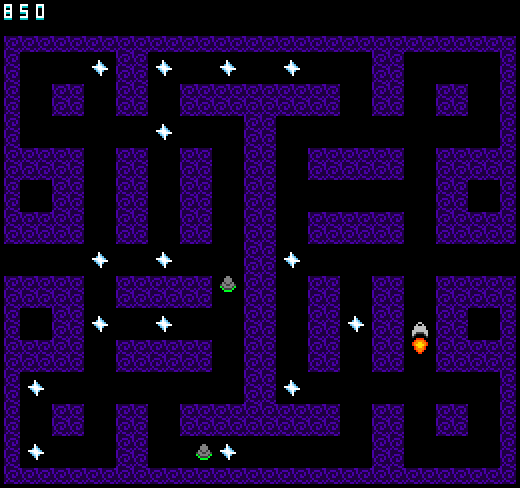

# STARPOWER

Author: Greg Loose

Design: STARPOWER is a Pac-Man inspired arcade game with a sci-fi theme and a fast-paced twist. Collect stars to build up speed, but be careful: you lose speed when you run into walls or enemy ships, and when you come to a full stop, it's game over!

Screen Shot:

How Your Asset Pipeline Works:

There are two main components to my asset pipeline: the sprite pipeline and the map pipeline.

The sprite pipeline starts with an 8x8 png tile image, which I draw and export in Aseprite. Then, in Pipeline.cpp, I load each png file using load_png and iterate through the pixel data. For each individual png, I keep a running palette of colors seen in that image, and fill out a Tile struct with indices into that palette. (Note: an error is thrown if more than four colors are seen-- or, specifically, more than three non-transparent colors, since I always assume index 0 to be fully transparent.) I do this twice, sorting the palette colors lexicographically the second time with full knowledge of all colors that appear in the tile. By sorting the palette colors, I can easily compare the palette to those seen in other tiles, and I only add a new palette to the palette table if it doesn't match any seen before. At the end of this process, I have a vector of tiles (which will be loaded into the tile table), a vector of palettes (which will be loaded into the palette table), and a vector of sprites, which I construct for each image using the indices of the newly tile and palette in their respective tables. The tile and palette tables are written via write_chunk to files dist/assets/tiles.til and dist/assets/palettes.pal, respectively. The sprites are actually each written to their own files, named after the game objects they represent for ease of access. All of these assets are then loaded with Load objects using read_chunk, with each sprite getting its own load object.

The map pipeline is similar in that it starts with a png file that I drew in Aseprite, but its output is a vector of MapNode structs. In my game, the map is divided into "nodes" representing the intersections of paths in the map, which store boolean values representing which cardinal directions the player may take to leave the node toward an adjacent node. In the map pipeline, the map.png file is broken up into 3x3 pixel blocks, on each of which I have drawn a map intersection. It is then a matter of reading the pixels on each outer edge of the block, where a filled-in pixel indicates that movement is possible in that direction. As an example, see the screenshot below: the bottom left block has the top and right pixels filled in, indicating that this map node should set its up and right values to "true".

How To Play:

Controls:
* ARROW KEYS to move
* R to restart after the game is over

STARPOWER is an arcade-style game where the goal is to score as many POINTS as possible. There are two ways to score POINTS:
* Collecting a STAR: 10 POINTS
* Crashing a UFO: 100 POINTS

You collect STARS by flying over them, and you crash UFOS by running into them at high SPEED.

Your SPEED does not give you any points, but is a very important part of the game, as when your speed drops to 0 it's GAME OVER! There are three ways to change your SPEED:
* Collecting a STAR: gain a small amount of SPEED
* Crashing a UFO: lose a large amount of SPEED
* "Bonking": lose HALF your SPEED

At high speeds, it is easier to collect stars and evade UFOs, but your ship NEVER STOPS MOVING, so you'll need quick reflexes to avoid BONKING! This occurs when your ship runs into a wall without holding a directional input to change directions in a right-angle turn from your current movement direction. Aside from cutting your speed in half, BONKING will cause you to bounce off the wall back the way you came; be careful not to get disoriented, lest you risk BONKING again!

Tips:
* STARPOWER is a fast-paced game, and if you only press the arrow keys the moment you come to a turn, you risk missing it entirely! Try holding the arrow keys in the direction you want to go BEFORE you come to a turn to make sure you don't mess up the timing.
* The R key is typically disabled outside of a GAME OVER to avoid accidental restarts, but if you're dead in the water at very low SPEED, restarting is enabled to get you back in the game right away.
* Remember, this isn't Pac-Man, and avoiding your enemies isn't always the best strategy! When your SPEED is high, it's better to hit an enemy and collect your 100 POINTS than to accidentally BONK and lose half your SPEED for nothing!
* Your enemies are not very smart; sometimes they try to chase after you, and sometimes they choose their moves randomly. When chasing, they try to move directly towards you, ignoring the screen loop or any sort of path finding. As a result, they often spend a lot of time on one half of the map until they accidentally wander their way out. Use this to your advantage!
* You can only turn at right angles; BONKING is the only way to instantly reverse your direction 180 degrees. On rare occasions, if you're really regretting a turn, BONKING intentionally may be your best move.

This game was built with [NEST](NEST.md).

